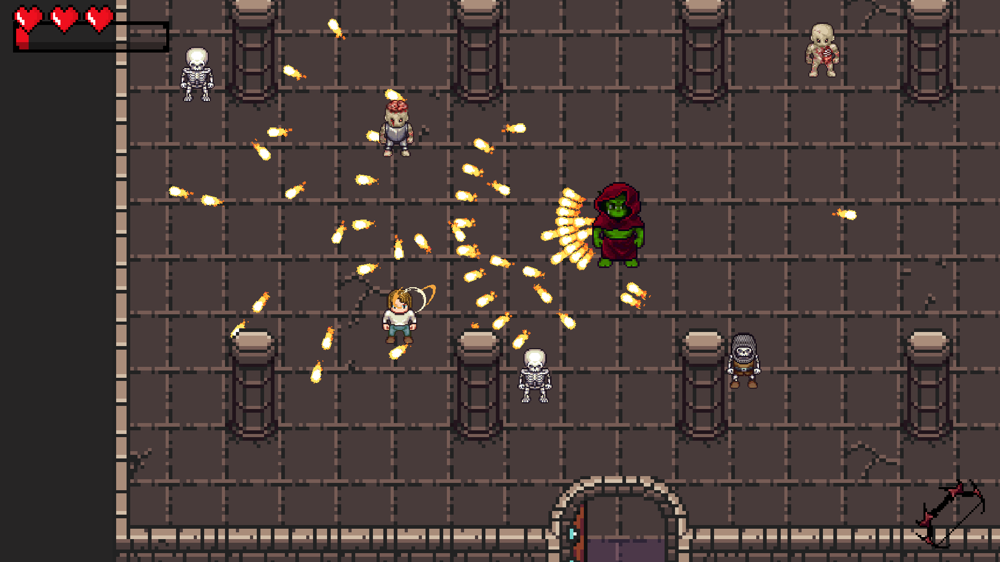
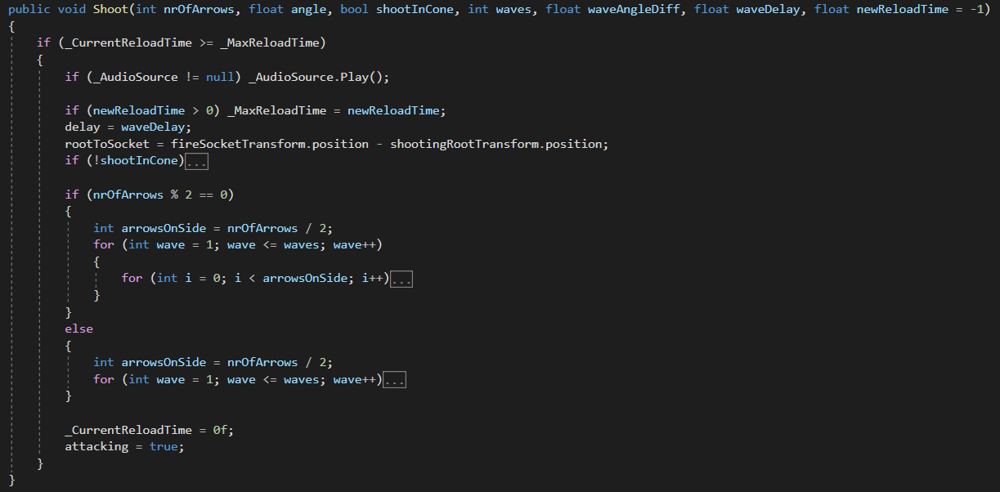
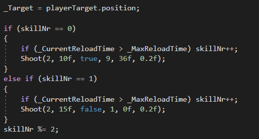

# What's Your Life Worth

*Please note that this is not the entire project. These are, however, all of the scripts I have written for this project.*

This game was made for the game mechanics course at Digital Arts and Entertainment, Howest, Belgium. It is a small dungeoncrawler/bullethell, where the player fights his way through rooms filled with enemies and picks up either upgrades or healing along the way.

# Shooting
Most of the code is not that complex, but there was one thing that I wanted to make as modular and reusable as possible: shooting. As this is basically a bullethell, *eveything* would in the end be able to shoot, and because of that reason, I spend quite some time figuring out the best way of tackling this.
I ended with a function that could pretty much do it all.

[Link to the actual function.](Scripts/BaseClasses/BaseShootingBehavior.cs)

For the simple AI in the game, this meant a single call to this function would generate an entire pattern of bullets, from a bullet-per-second to multiple waves all around. For example, this is how one of the bosses in the game generates their attack pattern:

After this was tackled, the rest was build up layer by layer. Story was put in place, interactive items were highlighted, some rooms were added and then time was up - after all, we only had 6 weeks for this project.
